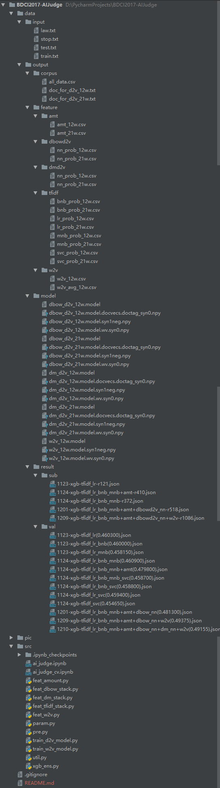

# BDCI2017-AIJudge

这是我近期参加的一个数据挖掘比赛，CCF 大数据与计算智能大赛（BDCI）中的一题：[**让 AI 当法官**](http://www.datafountain.cn/#/competitions/277/intro)。但是由于时间冲突与一些个人原因，我只参与并完成了初赛任务（罚金类别预测），并未完成复赛任务（法律条款预测）。在初赛成绩中，取得 **A 榜第 5**、**B 榜第 7** 的成绩。

该项目是我的第一个有关文本分类的项目，所以在做这题之前，我没有任何自然语言处理（NLP）的知识积累。因此，通过参与这个比赛，我的初衷是希望学到一些自然语言处理的基础知识，所以名次对于我来说没有那么重要了。

作为一个零基础的选手，自己从零构建整个项目是非常困难的。于是，我搜索了往年的有关文本分类的比赛，挑出了一些对于我个人而言，比较容易阅读的一些方案与源码。我选择了 2016 年的比赛：大数据精准营销中搜狗用户画像挖掘，并找到了[一等奖](https://github.com/hengchao0248/ccf2016_sougou)与[二等奖](https://github.com/AbnerYang/2016CCF-SouGou)的方案与源码，进行了详细的阅读，阅读源码的过程是很痛苦的，因为太多的这是什么那是什么这也不懂哪也不懂，但是正是经历过这样一个过程才能真正学到一些知识并完成一些实践。最终，依靠前辈们的方案与源码，零基础的我**成功搭建了一个 baseline 项目并在其上做出自己的一些思考与优化**。

## 向导

1. [方案](#方案)
    1. [1 数据预处理](#1-数据预处理)
    	1. [1.1 分词](#11-分词)
    	2. [1.2 去除停用词](#12-去除停用词)
    2. [2 特征构建](#2-特征构建)
    	1. [2.1 基于 tf-idf 的特征](#11-分词)
    	2. [2.2 基于 Doc2Vec 的特征](#12-去除停用词)
    	2. [2.3 基于 Word2Vec 的特征](#12-去除停用词)
    	2. [2.4 统计特征](#12-去除停用词)
    3. [3 模型](#3-模型)
2. [文件目录](#文件目录)
3. [执行顺序](#执行顺序)
4. [嘿！](#嘿)

## 方案

### 1 数据预处理

数据预处理只要包括**分词**和**去除停用词**，其达成的效果大致如下。

> 公诉机关霍邱县人民检察院。被告人许某甲，男，1975年9月20日生。2012年12月17日因涉嫌危险驾驶罪由霍邱县公安局取保候审。2013年3月4日经本院决定取保候审。霍邱县人民检察院以霍检刑诉（2013）42号起诉书指控被告人许某甲犯危险驾驶罪，于2013年2月27日向本院提起公诉。本院依法适用简易程序，实行独任审判，于2013年3月4日公开开庭审理了本案。霍邱县人民检察院检察员胡涛、被告人许某甲到庭参加诉讼。现已审理终结。霍邱县人民检察院指控：2012年12月2日19时30分左右，被告人许某甲酒后驾驶二轮摩托车沿霍寿路由南向北行驶至霍寿路与公园路交叉口时，与路边行人相撞，被公安民警查获。经六安市疾病预防控制中心鉴定，许某甲血液中乙醇含量为169.64mg／100ml。上述事实，被告人在开庭审理过程中亦无异议，并有被害人杨正响的陈述，证人李某甲的证言，《六安市疾病预防控制中心检验报告》六安市疾控交检字（2012）第155号，霍邱县公安局交通管理大队呼吸式酒精检测结果单，抽取当事人血样登记表，驾驶人信息查询结果单，道路交通事故赔偿调解协议书、经济赔偿凭证、谅解书，被告人的户籍信息等证据证明，足以认定。

会被转化为：

> 公诉 机关 霍邱县 人民检察院 被告人 许某 甲 男 1975 年 月 20 日生 2012 年 12 月 17 日 因涉嫌 危险 驾驶 罪 霍邱县 公安局 取保候审 2013 年 月 日经 本院 取保候审 霍邱县 人民检察院 以霍检 刑诉 2013 42 号 起诉书 指控 被告人 许某 甲犯 危险 驾驶 罪 2013 年 月 27 日向 本院 提起公诉 本院 依法 简易程序 实行 独任 审判 2013 年 月 日 公开 开庭审理 本案 霍邱县 人民检察院 检察员 胡涛 被告人 许某 甲 到庭 参加 诉讼 现已 审理 终结 霍邱县 人民检察院 指控 2012 年 12 月 日 19 时 30 分 被告人 许某 甲 酒后 驾驶 二轮 摩托车 沿霍寿路 由南向北 行驶 霍寿路 公园路 交叉口 时 路边 行人 相撞 公安民警 查获 六安市 疾病 预防 控制中心 鉴定 许某 甲 血液 中 乙醇 含量 169.64 mg 100ml 上述事实 被告人 开庭审理 过程 中 无异议 被害人 杨正响 陈述 证人 李某 甲 证言 六安市 疾病 预防 控制中心 检验 报告 六安市 疾控交 检字 2012 155 号 霍邱县 公安局 交通管理 大队 呼吸 式 酒精 检测 抽取 当事人 血样 登记表 驾驶 信息 查询 道路 交通事故 赔偿 调解 协议书 经济 赔偿 凭证 谅解 书 被告人 户籍 信息 证据 证明 足以认定

接下来，我会对这两个子处理进行介绍，并做出一些思考：在这些处理之上还能做些什么。

#### 1.1 分词

为了快速构建项目，我直接采取了比较热门的分词方案：**结巴分词**。

实际上，在此基础上还可以做的事情有很多（虽然我没有做），例如：

1. 采用多种分词方案（例如：NLPIR、THULC 等），实现分词
2. 使用某种模型（例如：贝叶斯模型等）比较这多种分词方案的效果
3. 对分词后的语料库进行统计分析，归纳改语料库的特点（例如：字典长度为多少；低频词多吗；该不该过滤掉某些词等等）

#### 1.2 去除停用词

中文中有非常多的停用词，这些停用词对于我们的文本分类任务是无用的。因此，我采取的措施是：**直接去除**。

有些任务对于一些停用词是敏感的。在这个阶段，还可以做的有：

1. 对停用词的进行分析，猜想某些停用词是有用的并验证猜想（个人感觉这个比赛的停用词是无用的）。

### 2 特征构建

我从 4 个方面对文本进行特征构建，分别是：**基于 tf-idf 的特征**、**基于 Doc2Vec 的特征**、**基于 Word2Vec 的特征**和**统计特征**。接下来，我会从这 4 个方面分别介绍。

#### 2.1 基于 tf-idf 的特征

tf-idf（英语：term frequency–inverse document frequency）是一种用于信息检索与文本挖掘的常用加权技术。tf-idf 是一种统计方法，用以评估一字词对于一个文档集或一个语料库中的其中一份文档的重要程度。字词的重要性随着它在文档中出现的次数成正比增加，但同时会随着它在语料库中出现的频率成反比下降。

我直接使用了 TfidfVectorizer 提取了语料库的 tf-idf 特征。但是 tf-idf 特征具有**多维稀疏**的特点。对于这类特征，直接扔给树模型的话不仅慢而且效果还差，因此比较流行的做法是做一层 stacking。我挑选了 LogisticRegression、BernoulliNB、MultinomialNB 和 LinearSVC 作为基模型分别对 tf-idf 特征进行训练，并构建下一层模型需要的特征，因此理论上能够产生 4\*8 的特征列数。但最终根据实验结果，我移除掉了 LinearSVC 模型，因此只留下了 3\*8 列的特征。

这里，还可以做的事情有：

1. 选取更多的模型对 tf-idf 特征进行训练，并比较效果，选取实验效果最好的几个进行 stacking

#### 2.2 基于 Doc2Vec 的特征

我使用 Doc2Vec 方法，**将文档直接表示成一个固定长度的向量**。根据训练文档向量的网络结构的不同，可以分为 **Distributed Memory**（DM）与 **Distributed Bag of Words**（DBOW）两种模型。其中 DM 模型不仅考虑了词的上下文语义特征，还考虑到了词序信息。DBOW 模型则忽略了上下文词序信息，而专注于文档中的各个词的语义信息。我同时采用了 DBOW 和 DM 这两种模型构建文档向量，希望能够保留文档中完整的信息。

对于 Doc2Vec 模型，我选取的维数是 300。在训练文档向量的过程中，我发现增量训练似乎可以提升文本分类的精度，因此我在训练过程中增加了训练的次数，DBOW 模型的训练次数为 5，DM 模型的训练次数为 10。

同样的，我对于这两类文档向量分别做了一层 stacking，使用了一个简易的神经网络模型，只有一层 300 维的隐含层，进行训练并构建下一层模型需要的特征。

这个地方，还可以做得事情有：

1. 比较 DBOW 和 DM 模型的效果，确定是否选用其中一种或者选用两种
2. 选用多种模型（例如：LR、NN、KNN 等）对这两类文档向量进行效果对比，选取其中最好的几种模型进行 stacking
3. 调优超参，包括 Doc2Vec 模型维数、增量训练次数等

#### 2.3 基于 Word2Vec 的特征

我使用了 Word2Vec 方法，**将词语直接表示成一个固定长度的向量**。对于 Word2Vec 模型，我选取的维数为 300，并将频数低于 5 的词语过滤掉。

那么对于一个文档来说，这些针对词语的向量要怎么处理呢？我选择了两种方式：

1. 属于同一个文档的词向量，直接相加
2. 属于同一个文档的词向量，加权平均（相加后的结果向量再除以文档的词数目）

由于一些个人原因，我只使用了第一种方式产生的特征向量。

实际上，这里可以做的事情还有：

1. 对这两种方式生成的特征向量设计实验（例如：只选用其中一种特征向量，同时选用两种特征向量），进行效果比较，选取效果最好的方式
2. 对于词向量维数和过滤的词频进行实验，选择最优的超参
3. 设计步长参数，选取多个维数所产生的词向量（例如：选择步长为 50，维数从 100 到 500。那么可以产生 100、150、200、……、500 维数的词向量）

#### 2.4 统计特征

该文本分类任务是预测案件金额类别，因此案件文本中出现的**金额**是重要的。于是，我使用正则表达式匹配出案件文本中出现的所有金额，然后对同一个案件中出现的所有金额进行统计，包括：求和、最小值、最大值、最大最小差值、平均值、标准差。

这里还可以做的事情有：

1. 统计案件文本的词的数目
2. 利用案件中的一些关键词做特征，例如：酒驾、毒品等
3. 案件文本中出现的日期
4. 案件文本中出现的地点

### 3 模型


上图给出了本次项目的模型结构。我采用了模型融合中 **stacking** 的思想，使用**两层**的模型结构。第一层使用传统的机器学习模型 LogisticRegression、BernoulliNB 和 MultinomialNB，来训练 tf-idf 特征，从而学习案件文本中的用词特点；其次还使用神经网络模型来训练 Doc2Vec-DBOW 和 Doc2Vec-DM 生成的文档向量特征，从而学习案件文本中的词语的语义关联信息。第二层使用 Xgboost 模型，训练 Word2Vec、统计特征和第一层模型传来的概率特征，从而更深入的学习案件文本与金额类别之间的联系。采用 stacking 的模型融合思想，可以进一步的提升模型预测的准确性和泛化能力。

## 文件目录

```
├─data
│  ├─input
│  └─output
│      ├─corpus
│      ├─feature
│      │  ├─amt
│      │  ├─dbowd2v
│      │  ├─dmd2v
│      │  ├─tfidf
│      │  └─w2v
│      ├─model
│      └─result
│          ├─sub
│          └─val
└─src
```

文件目录如上所示。```data``` 目录中包含所有的数据文件，由于数据文件较大，我没有上传；```src``` 目录中包含所有的代码文件。以下是详细介绍：

- ```data/input```：所有的源文件和停用词文件
- ```data/output/corpus```：数据预处理后的数据文件
- ```data/output/feature```：生成的各类特征文件
- ```data/output/model```：训练 Doc2Vec 和 Word2Vec 模型时产生的模型文件
- ```data/result/sub```：生成的结果文件（可提交至线上）
- ```data/result/val```：交叉验证产生的结果文件（这里的文件不提交）

目录内的文件大致如下：



## 执行顺序

我将交叉验证和全量训练预测分成了两个文件：```ai_judge_cv.ipynb``` 和 ```ai_judge.ipynb```。其次，还有一些冗余的脚本文件，分别是位于 ```src``` 目录下的 python 脚本。这些脚本文件只是 ```ai_judge_cv.ipynb``` 中的冗余代码，只是整理成了 python 脚本。脚本文件的执行顺序如下：

1. ```pre.py```：分词和去除停用词
2. ```feat_tfidf_stack.py```：构造 tf-idf stacking 特征
3. ```feat_amount.py```：构造统计特征
4. ```train_d2v_model.py```：训练 Doc2Vec 模型
5. ```feat_dbow_stack.py```：构造 Doc2Vec-DBOW stacking 特征
6. ```feat_dm_stack.py```：构造 Doc2Vec-DM stacking 特征
7. ```train_w2v_model.py```：训练 Word2Vec 模型
8. ```feat_w2v.py```：构造 Word2Vec 特征
9. ```xgb_ens.py```：使用 Xgboost 结合所有特征进行交叉验证

**强烈推荐**直接使用那两个 notebook 文件，因为这些冗余脚本有可能在我更新了 notebook 文件后并没有及时更新。

## 嘿！

如果您有任何的想法，例如：发现某处有 bug、觉得我对某个方法的讲解不正确或者不透彻、有更加有创意的见解，欢迎随时发 Issue 或者 Pull request 或者直接与我讨论！另外您若能 star 或者 fork 这个项目以激励刚刚踏入数据挖掘的我，我会感激不尽~